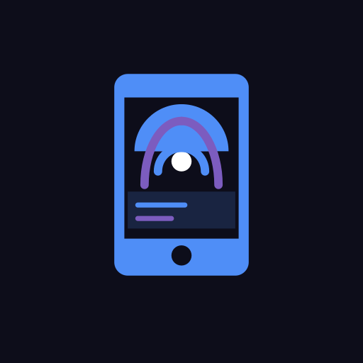

# Screen Stream

<p align="center">
  
</p>

> **Experimental**: core functionality works but the project is under active development. Expect rough edges.

Stream your Android screen to any browser on your local Wi-Fi network. No accounts, no cloud, no cables. Open the app, tap Start, and share the URL anyone on the same network can watch immediately in Chrome, Firefox, Safari, or any modern browser.


---

## Status

This project is functional for its primary use cases but should be considered experimental:

- Live MJPEG video streaming works reliably on most devices
- Audio streaming works on Android 10+ but may have latency depending on network conditions
- Screen rotation and foldable display adaptation is implemented but may show brief freezes during the transition
- Authentication is opt-in (PIN or Basic Auth); with it off, anyone on the network can view the stream
- HTTPS uses a self-signed certificate, so browsers will show a security warning that has to be accepted manually

---

## Features

- **Live video**: MJPEG stream viewable in any browser, no plugins required
- **Audio streaming**: captures device audio playback with configurable sample rate (16 / 22 / 44.1 / 48 kHz), channels (mono / stereo), and encoding (PCM 8-bit / 16-bit / 32-bit float)
- **Adjustable frame rate**: 5, 10, 15, 24, 30, or 60 fps
- **JPEG quality slider**: trade image sharpness for bandwidth
- **Configurable port**: any port from 1 to 65535, not just the default 8080 (ports below 1024 need root, and the app will tell you clearly if a port can't be bound)
- **Authentication**: optionally require a PIN or Basic Auth username/password to view the stream
- **Self-signed HTTPS**: optional toggle to serve over TLS instead of plain HTTP
- **Auto-restart**: automatically re-request the capture permission if the system stops the stream
- **Update check**: compares the running build against the latest commit on GitHub and links to it if you're behind
- **Settings remembered**: quality, frame rate, audio config, port, and auth settings persist across app restarts
- **Rotation and fold aware**: the viewer page adapts when you rotate or unfold the phone
- **Auto-reconnect**: both video and audio streams reconnect automatically if interrupted
- **No internet required**: everything stays on your local network (the optional update check is the only feature that reaches the internet, and only when you tap "Check Now")

---

## Why a browser instead of Miracast or Chromecast

Miracast and Chromecast are the standard ways to mirror an Android screen to a display, but both come with a long list of failure modes:

- **Miracast** requires Wi-Fi Direct, which many routers, corporate networks, and hotel networks block or simply don't support. Some Android manufacturers ship broken or incomplete Miracast implementations. Compatibility between sender and receiver hardware is inconsistent, and the connection setup frequently fails silently.
- **Chromecast** requires a Google account, the Google Home app, and both devices to be on the same network segment. It does not work on networks that isolate clients from each other (common in offices, hotels, schools, and mobile hotspots). It also requires the display to have a Chromecast device attached.
- Both protocols have **codec negotiation** that can fail depending on the device, driver, or firmware version. When they fail, there is usually no useful error message.

ScreenStream sidesteps all of this. It runs a plain HTTP server on your phone and serves MJPEG video over a standard browser request. Any device with a browser and a network connection can view the stream: a laptop, a desktop, a smart TV with a browser, another phone. There is no pairing, no app install on the viewer side, no codec negotiation, no protocol handshake that can silently fail. If the browser can load a webpage, it can display the stream.

This makes it particularly useful in environments where casting protocols are unreliable: presentations from a phone to a projector connected to a laptop, streaming to a car's built-in browser, or demonstrating an app on a network that blocks Wi-Fi Direct.

### Projector / presentation
Connect a laptop to the projector, open the stream URL in a browser. Present from your phone wirelessly, no HDMI dongle, no screen mirroring app on the laptop.

### Mobile game on a TV
Stream a game with audio to a smart TV browser or a laptop connected to the TV. Works with any game that plays audio through the system.

### Car screen
Open the stream URL in the car's built-in browser to mirror your phone on the center display. Note for Tesla: the in-car browser refuses to route to RFC 1918 private IP addresses (`10.0.0.0/8`, `172.16.0.0/12`, `192.168.0.0/16`), so the phone's address needs to fall outside those ranges to work.

### Demo or support
Show someone exactly what is on your screen over a local network. Useful for tech support, app demonstrations, or walking someone through a process on the phone.

### Home dashboard
Leave the stream open on a wall-mounted screen or tablet to display a home automation dashboard, live camera feed, or any app running on the phone.

---

## Requirements

- Android 6.0 or newer (API 23+)
- Wi-Fi connection shared with the viewing device
- Audio capture requires Android 10 or newer (API 29+)

---

## Setup

```bash
git clone https://github.com/P6g9YHK6/ScreenStream.git
cd ScreenStream
```

## Build

### Prerequisites

- Android Studio Hedgehog (2023.1) or newer
- JDK 17
- Android SDK with API 36

### From Android Studio

1. Open the `ScreenStream` folder
2. Let Gradle sync complete
3. Connect a device with USB debugging enabled
4. Run → Run 'app'

### From the command line

```bash
cd ScreenStream
./gradlew assembleDebug
adb install app/build/outputs/apk/debug/app-debug.apk
```

### GitHub Actions

Every push builds both a debug and unsigned release APK, available as workflow artifacts for 30 days.

---

## Usage

1. Open **ScreenStream** on your Android device
2. Configure frame rate, quality, audio settings, port, authentication, and HTTPS as needed
3. Tap **Start Streaming** and accept the screen capture prompt
4. The app shows the stream URL, for example `http://192.168.1.42:8080`, or `https://192.168.1.42:8080` if the HTTPS toggle is on
5. Open that URL in any browser on the same Wi-Fi network (accepting the certificate warning first if HTTPS is on)

---

## Permissions

| Permission | Purpose |
| --- | --- |
| `FOREGROUND_SERVICE` / `MEDIA_PROJECTION` | Required to capture the screen while the app runs in the background |
| `INTERNET` | Serves the HTTP stream to other devices on the network |
| `RECORD_AUDIO` | Audio capture (Android 10+, optional) |
| `ACCESS_WIFI_STATE` | Reads the local IP address to display the stream URL |
| `POST_NOTIFICATIONS` | Error notifications on Android 13+ |

---

## Known limitations

- The self-signed HTTPS certificate has no Subject Alternative Name, so browsers show a certificate warning in addition to the usual self-signed warning; this is cosmetic and doesn't affect functionality
- Audio streaming is PCM over raw HTTP; some browsers may not support auto-play without a user gesture
- Maximum capture resolution is capped at 1280px on the long edge for performance
- Not tested on all Android versions or device configurations
